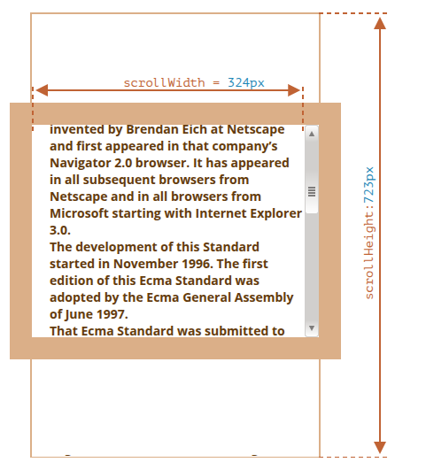

# Element Size & Scrolling

- js allow us to read info of element width, height, etc.

## offsetParent, offsetLeft/Top

- The `offsetParent` is the nearest ancestor that the browser `uses for calculating coordinates during rendering`.
- That’s the nearest ancestor that is one of the following:

  - CSS-positioned (position is absolute, relative, fixed or sticky), or
  - `<td>`, `<th>`, or `<table>`, or
  - `<body>`.

- Properties `offsetLeft/offsetTop` provide x/y coordinates relative to `offsetParent` upper-left corner.
- This property will

```html
<main style="position: relative" id="main">
  <article>
    <div id="example" style="position: absolute; left: 180px; top: 180px">
      ...
    </div>
  </article>
</main>
<script>
  example.offsetLeft = 120;
  alert(example.offsetParent.id); // main
  alert(example.offsetLeft); // 180 (note: a number, not a string "180px")
  alert(example.offsetTop); // 180
</script>
```

## offsetWidth/Height

- They provide the “outer” width/height of the element. Or, in other words, its full size including borders.
- Example:
  - `offsetWidth = 390` – the outer width, can be calculated as inner CSS-width (300px) plus paddings (2 x 20px) and borders (2 x 25px).
  - `offsetHeight = 290` – the outer height.

## clientTop/left

- return width of top/left border acoording to clientTop/Left

## clientWidth/Height

- These properties provide the size of the area inside the element borders.
- They include the content width together with paddings, but without the scrollbar:
- If there are no paddings, then `clientWidth/Height` is exactly the content area, inside the borders and the scrollbar (if any).

## scrollWidth/Height

- These properties are like clientWidth/clientHeight, but they also include the scrolled out (hidden) parts:

  

- On the picture above:
  - `scrollHeight = 723` – is the full inner height of the content area including the scrolled out parts.
  - `scrollWidth = 324` – is the full inner width, here we have no horizontal scroll, so it equals clientWidth.

## scrollLeft/scrollTop

- Properties `scrollLeft/scrollTop` are the width/height of the hidden, scrolled out part of the element.
- `scrollLeft/scrollTop` can be modified.

# Experiment

- what's the scroll from bottom

```js
let div = document.createElement("div");

div.style.overflowY = "scroll";
div.style.width = "50px";
div.style.height = "50px";
document.body.append(div);

let scrollwidth = div.offsetWidth - div.clientWidth;
div.remove();
console.log(scrollwidth); // 15
```

- there is ball top-left corner and we want to place to center of screen
  ```js
  ball.style.left = Math.round(field.clientWidth / 2) + "px";
  ball.style.top = Math.round(field.clientheight / 2) + "px";
  ```
