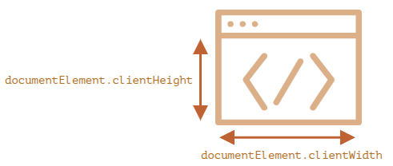

## Width/height of the window

- To get window width and height, we can use the `clientWidth/clientHeight` of `document.documentElement`:

  

## Width/height of the document

## Get the current scroll

- the scroll is available in the special properties, `window.pageXOffset/pageYOffset`:

  ```js
  alert("Current scroll from the top: " + window.pageYOffset);
  alert("Current scroll from the left: " + window.pageXOffset);
  ```

- Also available as window properties `scrollX` and `scrollY`
  - window.pageXOffset is an alias of window.scrollX.
  - window.pageYOffset is an alias of window.scrollY.

## Scrolling: scrollTo, scrollBy, scrollIntoView

- To scroll the page with JavaScript, its DOM must be fully built.
- For instance, if we try to scroll the page with a script in `<head>`, it won’t work.

- The method `scrollBy(x,y)` scrolls the page relative to its current position. For instance, `window.scrollBy(0,10)` scrolls the page 10px down.
- The method `scrollTo(pageX,pageY)` scrolls the page to absolute coordinates, so that the top-left corner of the visible part has coordinates (pageX, pageY) relative to the document’s top-left corner. It’s like setting scrollLeft/scrollTop.
- `elem.scrollIntoView(top)` scrolls the page to make elem visible. top will be `true` (default) or `false`

- To make the document unscrollable, it’s enough to set `document.body.style.overflow = "hidden"`. The page will “freeze” at its current scroll position.
