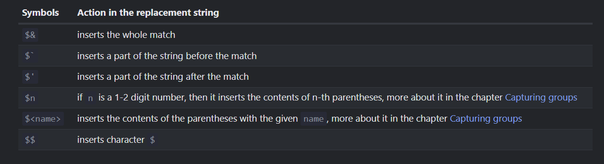

# Patterns and flags

## Regular Expressions
- Regular expressions are patterns that provide a powerful way to search and replace in text.
- In JavaScript, they are available via the `RegExp` object
- There are two syntaxes
    - The `“long”` syntax:
        ```JavaScript
        let regexp = new RegExp("pattern","Flag")
        ```
    - And the `“short”` one, using slashes `"/"`:
        ```JavaScript
        let sortRegexp = /pattern/; // No flag
        let another = /pattern/gmi; // With flags g,m and i
        ```
    - Main Difference with both ways is that slash `/.../` way not allow for Expressions to be inserted.

## Flags
- Regular Expressions may have flag that affect in search
- There are 6 flags
    - `i` - With this flag the search is `case-insensitive`
    - `g` - With this flag the search looks for `all matches`
    - `m` - Multiline mode
    - `s` - Enables `“dotall”` mode, that allows a dot . to match newline character \n
    - `u` - Enables full `Unicode support`.
    - `y` - `“Sticky”` mode: searching at the exact position in the text


# Searching
- The method `str.match(regexp)` finds all matches of regexp in the string str.
- it has 3 working mode:
    1. With `g`, return array of all matches:
        ```JavaScript
        let str = "We will, we will rock you";
        console.log(str.match(/we/gi)); // Return - [ 'We', 'we' ] 
        ```
    2. Only `i`, return first match:
        ```JavaScript
        console.log(str.match(/we/i));
        ```
    3. If there are no Match:
        ```JavaScript
        let nothing = str.match(/eW/)
        console.log(nothing); // Return - null
        ```

# Replacing
- The method `str.replace(regexp, replacement)` replaces matches found using `regexp` in string `str` with `replacement`.

    ```JavaScript
    console.log(str.replace(/we/i,"I")); // Return - I will, we will rock you
    ```

- The second argument is the `replacement` string. We can use special character combinations:

    

    ```JavaScript
    console.log(str.replace(/rock/i, "$& Odd")); // Return - We will, we will rock Odd you
    console.log(str.replace(/rock/i, "$` Odd")); // Return - We will, we will We will, we will  Odd you
    console.log(str.replace(/rock/i, "$' Odd")); // Return - We will, we will  you Odd you
    ```

# Testing

- The method `regexp.test(str)` looks for at least one match, if found, returns `true`, otherwise `false`.
    ```JavaScript
    let str = "I love JavaScript";
    let regexp = /LOVE/i;

    alert( regexp.test(str) ); // true
    ```

## Go back to IndexedDB

- [IndexedDB](../21_Storing_Data_in_Browser/IndexedDB.md)

## Now Learn about Character Classes

- [Character Classes](./02%20Char_classes.md)