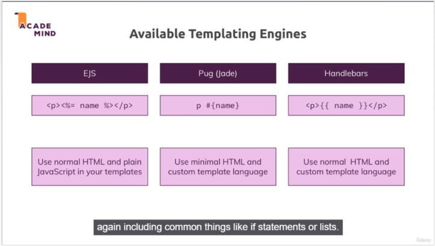

# Dynamic Content with template Engine

- Template engine helps us to create an `HTML template with minimal code`. Also, it can **inject data into HTML** template `at client side` and produce the final HTML.

- There are many template engines available for Node.js. `Each template engine uses a different language to define HTML template` and `inject data` into it.
  1. **Jade (Pug)**
  2. **EJS**
  3. **Dust**
  4. **Marko**
  5. **Handlebars** etc.

### Advantages of Template engine in Node.js

1. Improves developer's `productivity`.
2. Improves `readability` and `maintainability`.
3. `Faster` performance.
4. Maximizes client side processing.
5. `Single template` for multiple pages.
6. Templates can be `accessed from CDN` (Content Delivery Network).

